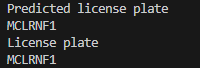

# PlateMate

PlateMate is a Python application that detects license plates in car images and recognizes their characters using image processing and machine learning techniques.

## Method

1. **Detect License Plate**: The application starts by detecting potential license plate regions within a car image using Connected Component Analysis (CCA).
   
2. **Segment Characters**: Once the license plate region is identified, the characters on the plate are segmented using image processing techniques.
   
3. **Train ML Model**: The segmented characters are used to train a machine learning model. In this case, a Support Vector Classifier (SVC) is trained using a dataset of character images.

4. **Predict Characters**: Finally, the trained model predicts the characters on the license plate based on the segmented images.

The process involves converting the car image to grayscale, applying binary thresholding, performing CCA to identify connected regions (license plate candidates), and applying specific size constraints to detect the actual license plate.

## Set up your environment

1. **Create a virtual environment:**

    ```bash
    python -m venv env
    ```

2. **Activate the virtual environment:**

    - On Windows:
    
      ```bash
      .\env\Scripts\activate
      ```

    - On macOS/Linux:
    
      ```bash
      source env/bin/activate
      ```

3. **Install dependencies:**

    ```bash
    pip install -r requirements.txt
    ```

4. **Run the application:**

    - **Run PredictCharacters.py**

      - **Load the Trained Model:**

         Ensure you have `finalized_model.sav` in your repository. This pre-trained model will be loaded by PredictCharacters.py.

      - **Execute PredictCharacters.py:**

        Running PredictCharacters.py initiates the following steps:
      
        - Converts the input image to grayscale and binary images.
        - Detects the license plate within the grayscale image and draws a bounding box around it.
        - Segments individual characters from the license plate and displays each character within bounding boxes.
        - Utilizes the loaded model (`finalized_model.sav`) to predict the characters on the license plate.

       Make sure to provide the path to the appropriate image or video file within PredictCharacters.py for accurate detection and prediction.

      - **Training Your Own Model:**

        You can also train your own model using the dataset provided (`train20X20`). Customize and modify `TrainRecogniseCharacters.py` to train and save your model as `finalized_model.sav`.

      - **Execution:**

        Execute the script using the following command:

        ```bash
        python PredictCharacters.py
        ```

## Screenshots

1. Car Image

>Original Image


>License Plate Detected


>Segmented characters


>Predicted characters


